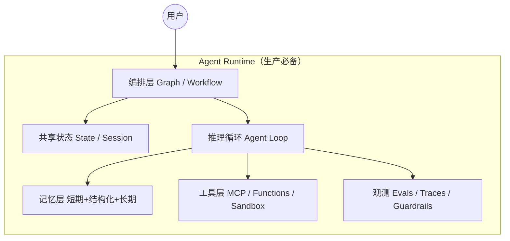

# AI Agent 架构调研（2025-2026）

## 研究问题

在可靠性、可观测性、成本与安全合规约束下，2025-2026 年构建**生产级 AI Agent** 的主流架构分层、推理循环、记忆/工具/编排方案及框架选型最佳实践是什么？

## 评估维度

| 维度 | 说明 |
|------|------|
| 架构分层清晰度 | 感知-规划-执行-记忆-编排是否可替换、可测试 |
| 生产可靠性 | 错误恢复、HITL、持久化、评测回归 |
| 工具互操作 | MCP、函数调用、沙箱、权限边界 |
| 多 Agent 编排 | supervisor / handoff / graph 的可维护性 |
| 成本与延迟 | token 预算、缓存、并行、停止条件 |

---

## 一、行业共识：Agent 不是「更长的 Chat」

Anthropic 将 **Workflow**（预定义代码路径 + LLM 节点）与 **Agent**（LLM 动态决定工具与下一步）明确区分，并强调多数成功落地偏**简单、可组合**的模式，而非堆框架复杂度。([Building effective agents](https://www.anthropic.com/research/building-effective-agents))

2025 年后，工程重心从「单 prompt 变聪明」转向：

1. **显式状态机 / 图编排**（LangGraph、ADK、Temporal）
2. **可恢复运行时**（checkpoint、pause/resume、durable execution）
3. **上下文工程**（策展进入窗口的内容，对抗 context rot）([Context engineering](https://www.anthropic.com/engineering/effective-context-engineering-for-ai-agents))

---

## 二、推理循环：按任务复杂度分层

| 模式 | 机制 | 适用场景 | 风险 |
|------|------|----------|------|
| **ReAct / Tool-use loop** | 推理与工具调用交织 | 短任务、检索、API 调用 | 轮次失控、成本放大 |
| **Plan-then-Execute** | 先规划再逐步执行 | 可拆解、步骤可验证任务 | 计划僵化、环境变化 |
| **Reflection / Critic** | 生成后自我/外部评审修正 | 高风险输出（代码、合规） | 延迟与 token 翻倍 |
| **Workflow 节点** | 固定 DAG + LLM 节点 | 流程稳定、审计要求高 | 灵活性低 |

经典基线 [ReAct (2022)](https://arxiv.org/abs/2210.03629) 仍是工程实现的心理模型；2025 论文 [Plan-then-Execute](https://arxiv.org/abs/2509.08646) 强调安全与韧性。生产实践通常把循环**嵌入图/工作流**，并设置 **max turns、停止条件、HITL 卡点**。([OpenAI Agents SDK](https://openai.github.io/openai-agents-python/agents/))

---

## 三、记忆架构：三层而非「向量库万能」

| 层级 | 内容 | 典型实现 |
|------|------|----------|
| **短期** | 当前 thread 消息、tool 结果 | 上下文窗口、session API |
| **结构化状态** | 任务进度、schema、artifact | LangGraph State、ADK session、Pydantic models |
| **长期** | 跨会话知识、用户偏好 | 向量检索、知识库、外部 DB |

Google 2026 长运行 Agent 博文指出：无限堆叠聊天历史会导致**污染、成本爆炸与幻觉**；应使用持久 session、事件驱动 resume、golden eval。([Google ADK long-running agents](https://developers.googleblog.com/en/build-long-running-ai-agents-that-pause-resume-and-never-lose-context-with-adk/))

Anthropic「上下文工程」主张：把 system、tools、MCP、外部数据、历史**当作有限注意力预算**持续策展。([Context engineering](https://www.anthropic.com/engineering/effective-context-engineering-for-ai-agents))

---

## 四、单 Agent vs 多 Agent

| 模式 | 描述 | 何时用 | 代价 |
|------|------|--------|------|
| **单 Agent + 多工具** | 一个 loop 调 MCP/函数 | 默认起点、边界清晰 | 工具过多时失焦 |
| **Manager / Agents-as-tools** | 主 Agent 把子 Agent 当工具 | 专业分工（检索/代码/审核） | 编排与 trace 复杂 |
| **Handoff** | 控制权交给另一 Agent | 意图路由、多领域客服 | 状态交接要设计 |
| **Supervisor + Workers** | 中央调度多 worker | 并行子任务 | 调试难、成本高 |
| **Debate / Reviewer** | 多模型互审 | 高风险决策 | 延迟显著 |
| **Swarm / Peer** | 对等网络协作 | 探索型研究 | 生产慎用 |

OpenAI Agents SDK 明确区分 **Manager** 与 **Handoffs**。([Agents](https://openai.github.io/openai-agents-python/agents/))  
AWS Strands 文档覆盖 model-driven loop、supervisor、swarm 及 OTel 观测。([Strands deep dive](https://aws.amazon.com/blogs/machine-learning/amazon-strands-agents-sdk-a-technical-deep-dive-into-agent-architectures-and-observability/))

**共识**：多 Agent 仅在**角色边界清楚**时有 ROI；否则优先单 Agent + 好工具 + 好状态机。

---

## 五、工具层：MCP 接近事实标准，A2A 补充 Agent 间通信

**MCP (Model Context Protocol)** 以 JSON-RPC 连接 Host / Client / Server，标准化 **Resources / Prompts / Tools**，并写入安全原则（用户同意、数据隐私、工具安全）。([MCP spec](https://modelcontextprotocol.io/specification/latest))

- Anthropic 2024 发布 MCP，目标替代碎片化 connector。([MCP announcement](https://www.anthropic.com/news/model-context-protocol))
- OpenAI Agents SDK ([MCP 文档](https://openai.github.io/openai-agents-python/mcp/))、Google ADK、Pydantic AI、AutoGen、AWS Strands 均已支持 MCP
- **MCP 正在快速收敛为跨厂商工具互操作标准**，但「事实标准」仍取决于企业落地广度；**MCP ≠ 业务 API**——稳定内部服务仍常用 OpenAPI/typed function calling，MCP 更适合**外部工具与上下文生态**接入

**A2A (Agent-to-Agent)** 由 Google 2025 提出，定位 **Agent 间互操作**，**补充** MCP 而非替代。([A2A announcement](https://developers.googleblog.com/en/a2a-a-new-era-of-agent-interoperability/))

---

## 六、框架选型对比（2025-2026）

| 框架 | 定位 | 架构分层 | 可靠性 | 工具/MCP | 多 Agent | 观测/评测 | 适合谁 |
|------|------|:--------:|:------:|:--------:|:--------:|:---------:|--------|
| **LangGraph** | 低层图编排 runtime | 5 ✓ | 4 | 4 | 4 | 4 (LangSmith) | 复杂状态机、要完全控制 |
| **OpenAI Agents SDK** | OpenAI 栈官方 SDK | 4 | 4 | 5 ✓ | 5 ✓ | 4 | OpenAI 模型、快速落地 |
| **Google ADK** | Gemini/Vertex 企业栈 | 4 | 5 ✓ | 4 | 4 | 4 | GCP 部署、长运行 Agent |
| **CrewAI** | 角色型 Crew/Flow | 3 | 3 | 3 | 5 ✓ | 3 | 原型、角色扮演协作 |
| **AutoGen / AG2** | 事件驱动多 Agent | 3 | 3 | 4 | 5 ✓ | 4 (OTel) | 研究、对话式多 Agent |
| **Pydantic AI + Temporal** | 类型安全 + 耐久执行 | 4 | 5 ✓ | 4 | 3 | 4 | 长流程、要强恢复/HITL |
| **AWS Strands** | AWS 生态 Agent SDK | 4 | 4 | 5 ✓ | 4 | 4 | AWS 用户、Bedrock 栈 |

> ✓ 该维度相对最优（可并列）  
> 评分 1-5，依据官方文档与 2025 横向对比 ([Langfuse comparison](https://langfuse.com/blog/2025-03-19-ai-agent-comparison))

**选型主轴**：

- **要控制力** → LangGraph / Temporal + 自建
- **要速度（OpenAI 生态）** → OpenAI Agents SDK
- **要 Google 云一体化** → ADK
- **要角色协作原型** → CrewAI
- **要学术/对话式多 Agent** → AutoGen/AG2

### 未列入主表但值得知道的框架（Agent X 异构补充）

| 框架 | 定位 | 为何不进入主推荐 |
|------|------|------------------|
| **Microsoft Semantic Kernel** | .NET/企业多 Agent 编排 | 适合已有 Microsoft 栈；与 LangGraph 功能重叠，生态偏 Azure ([SK Agent Framework](https://learn.microsoft.com/en-us/semantic-kernel/frameworks/agent/)) |
| **LlamaIndex Workflows** | RAG-heavy、事件驱动 Agent 工作流 | 检索/知识库场景强；通用编排不如 LangGraph 灵活 ([LlamaIndex Agents](https://docs.llamaindex.ai/)) |
| **Haystack Agents** | 开源 NLP pipeline + tool-using agent | 偏搜索/RAG pipeline；多 Agent 编排非核心卖点 ([Haystack Agents](https://docs.haystack.deepset.ai/docs/agents)) |

---

## 七、生产必备：观测、评测、护栏

| 能力 | 做什么 | 代表工具 |
|------|--------|----------|
| **Tracing** | 记录每步 model/tool/state span | LangSmith, Phoenix (OTel), Braintrust |
| **Evals** | 离线 golden set + 在线抽样 | promptfoo, LangSmith, Braintrust |
| **Guardrails** | 输入/输出/工具审批 | OpenAI Agents guardrails, CrewAI guardrails |
| **HITL** | 高风险工具人工批准 | LangGraph interrupt, ADK, Temporal |

OpenTelemetry 正成为跨框架观测底座。([Braintrust observability 2026](https://www.braintrust.dev/articles/agent-observability-complete-guide-2026))  
Promptfoo 强调 Agent **整系统非确定性**，中间步骤也要评。([LangGraph eval guide](https://www.promptfoo.dev/docs/guides/evaluate-langgraph/))

---

## 八、冲突与反证（ACH-lite）

| 分歧点 | 一方 | 另一方 | 裁决 |
|--------|------|--------|------|
| 是否「全员多 Agent」 | CrewAI/AutoGen 叙事偏强 | Anthropic/OpenAI 偏简单组合 | **中置信**：按边界选，默认单 Agent |
| MCP 是否唯一工具标准 | MCP 生态快速扩张 | 企业内部 OpenAPI 仍主流 | **高置信**：MCP 为互操作层，非业务 API 替代 |
| 框架 vs 自建 | LangGraph 等降低编排成本 | 简单场景 workflow 够用 | **高置信**：复杂/long-running 用图+耐久运行时 |

主动反证搜索：过度自主 Agent 链路的**成本与错误放大**已被 Anthropic 文档明确警告。([Building effective agents](https://www.anthropic.com/research/building-effective-agents))

---

## 主要来源

- [Anthropic: Building effective agents](https://www.anthropic.com/research/building-effective-agents) — 置信度：高
- [Anthropic: Context engineering](https://www.anthropic.com/engineering/effective-context-engineering-for-ai-agents) — 高
- [MCP Specification](https://modelcontextprotocol.io/specification/latest) — 高
- [OpenAI Agents SDK](https://openai.github.io/openai-agents-python/) — 高
- [Google ADK docs](https://google.github.io/adk-docs/) — 高
- [LangGraph overview](https://docs.langchain.com/oss/python/langgraph/overview) — 高
- [Temporal + Pydantic AI](https://temporal.io/blog/build-durable-ai-agents-pydantic-ai-and-temporal) — 中高
- [Google A2A](https://developers.googleblog.com/en/a2a-a-new-era-of-agent-interoperability/) — 高

---

## 推荐

**结论**：2025-2026 生产级 Agent 的「主流架构」是 **显式编排运行时 + 分层记忆 + MCP 工具层 + 内建观测/评测/护栏**，推理循环按任务选 ReAct/Plan-Execute/Reflection，**默认单 Agent**，仅在角色边界清楚时引入多 Agent。

**理由**：
1. 长流程可靠性依赖 **state/checkpoint/durable execution**，而非更长 prompt
2. MCP 正在快速收敛为跨厂商工具互操作标准层（企业内部稳定 API 仍常用 OpenAPI / typed functions）
3. 框架选型应跟随**模型与云生态锁定**，而非追逐 GitHub star

**适用条件**：
- 团队已有 OpenAI → OpenAI Agents SDK + MCP
- 复杂审批/长流程 → LangGraph 或 Temporal + Pydantic AI
- GCP/Gemini 企业部署 → Google ADK
- 快速角色协作原型 → CrewAI（上线前补观测与评测）

**置信度**：**中高**（基于 ≥15 个独立官方/规范来源，三方异构搜索一致）

---

## 待验证风险

- [ ] 所选框架的 **license 与 maintainer 活跃度**（AG2/AutoGen 过渡、CrewAI 企业版边界）
- [ ] **MCP Server 供应链安全**（第三方 MCP 权限过大）
- [ ] **多 Agent 在生产环境的真实 p99 延迟与 token 成本**（需自家 workload benchmark）
- [ ] **A2A 协议**尚早，跨厂商互操作落地程度需跟踪 2026 H2

---

## Agent X 独有发现与处置（异构审计）

| 发现 | 处置 | 理由 |
|------|------|------|
| Pydantic AI + Temporal 耐久执行 | **保留** | 已写入框架对比表与推荐 |
| AWS Strands SDK | **保留** | 已写入多 Agent 与框架表 |
| Google A2A 协议 | **保留** | 已写入工具层，标注尚早 |
| Semantic Kernel / LlamaIndex / Haystack | **部分保留** | 补入「未列入主表」边界说明 |
| Langfuse 框架横向对比 | **保留为 secondary** | 评分参考，非唯一依据 |

---

## 调研 Metadata

- **Phase 2.5 Reflection**: 子问题 6/6 覆盖；独立来源充足；High quality ≥30%；追搜 **No**
- **Phase 5.5 Citation Health**: Layer A 17/17 ok (PASS) | Layer B 5 claims sampled, 0 not-supported (PASS)
- **Phase 6 异构终审 verdict**: Refine → 已 incorporate 3 条修订
- **辩论收敛**: Round 1 建议全部 accept/partial 后收敛（无需人类裁决）
- **人类介入**: 无
- **Output**: /Users/yongqian/Desktop/AICAP/AI-Agent架构调研-完整报告.md
- **HTML**: /Users/yongqian/Desktop/AICAP/AI-Agent架构调研-完整报告.html
- **Audio**: /Users/yongqian/Desktop/AICAP/AI-Agent架构调研-音频概要.m4a
- **Filename collision**: none

#### Phase 6 辩论历史

##### Round 1
| 建议 | 立场 | 论据 |
|------|------|------|
| 补 Agent X disposition 表 | accept | 增强异构审计可追溯性 |
| 补 Semantic Kernel / LlamaIndex / Haystack | partial | 以边界表呈现，不膨胀主矩阵 |
| 「MCP 事实标准」降调 + caveat | accept | 与 OpenAPI 并存更符合证据 |

#### Phase 2.5 Reflection

| 检查项 | 结果 |
|--------|------|
| 子问题覆盖率 | 6/6 ✓ |
| 关键 claim 双源 | 绝大多数 ✓ |
| Vendor-only 依赖 | Langfuse 对比文为 secondary，关键结论有官方文档支撑 |
| Source Quality | High 占比 >50% |
| 追搜决策 | **No** — 证据已足够进入综合 |
