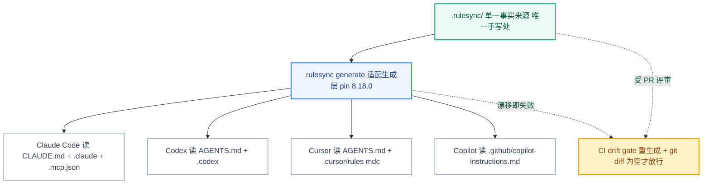

# ai-capabilities 使用文档

> 跨 AI 编码工具（Claude Code / Cursor / Codex / Copilot）可复用能力的**单一事实来源（SSOT）**骨架仓库 —— 完整介绍与操作手册。
> 版本：rulesync@8.18.0 ｜ 文档日期：2026-05-16

---

## 1. 这是什么（一句话）

一个 git 仓库，让团队所有 AI 编码工具的项目级指令 / 技能 / 子代理 / 命令 / MCP **只在一个地方（`.rulesync/`）手写一次**，用 `rulesync` 自动生成到每个工具各自的目录和文件名，并用 CI 保证"生成产物永远 == 当前源"。

**解决的问题**：没有它时，CLAUDE.md、AGENTS.md、`.cursor/rules`、Copilot instructions 各写一份，手工同步必然漂移、互相矛盾、没人敢动。

---

## 2. 为什么这样设计（背景）

到 2026 年，跨工具复用 AI 能力已经收敛到**两个开放标准 + 一个运行时协议**：

| 支柱 | 定位 | 说明 |
|---|---|---|
| **AGENTS.md** | 配置/约定（WHAT/WHERE） | OpenAI 2025-08 提出，60k+ 仓库，Linux Foundation/AAIF 托管，Codex/Cursor/Copilot 等 26+ 工具原生读 |
| **SKILL.md / Agent Skills** | 流程能力（HOW） | Anthropic 开放标准，~37 客户端采用，渐进式披露（启动只载名称+描述，命中才载全文） |
| **MCP** | 工具访问（TOOLS） | 运行时层，官方 Registry（仍 preview），各工具通用消费 |

**关键约束**：**Claude Code 不原生读 AGENTS.md，只读 `CLAUDE.md`**（官方 memory 文档明确）。这正是需要一个"适配生成层"的根本原因 —— 同一份源，要落到每个工具不同的文件名/目录。`rulesync` 就是这个适配层。

**心智模型**：`rules = 配置/约定` · `skills = 流程能力` · `mcp = 工具访问`，三者正交，不混在一个文件里。

> 完整调研依据见上层目录《跨AI编码工具能力体系化管理-完整报告》。本仓库是该报告"落地最小 7 步"的可运行实现，已端到端验证。

---

## 3. 架构总览



---

## 4. 目录结构详解

```
ai-capabilities/
├── .rulesync/                  ← SSOT，唯一手写处
│   ├── rules/
│   │   ├── overview.md         root 规则（root:true，所有工具全程加载，保持 <200 行）
│   │   └── testing.md          路径作用域规则（按 glob 触发，演示"分层"）
│   ├── skills/
│   │   ├── project-context/SKILL.md     可复用能力包：拉齐项目上下文
│   │   └── conventional-commit/SKILL.md  可复用能力包：生成规范提交信息
│   ├── subagents/planner.md    子代理定义（只读分析、不写码的规划者）
│   ├── commands/review-pr.md   slash command（/review-pr）
│   ├── mcp.json                MCP server 清单（只写 env 占位，不写密钥）
│   ├── hooks.json              生命周期钩子（postToolUse 格式化）
│   ├── hooks/format.sh         钩子脚本（按团队 formatter 替换）
│   └── .aiignore               AI 工具忽略路径
├── rulesync.jsonc              生成配置：目标工具、特性、是否 gitignore 产物
├── package.json                ai:generate / ai:check / ai:eval 脚本 + pin rulesync
├── promptfoo/promptfooconfig.yaml  高价值 skill 的回归门禁（stub）
├── .github/workflows/ai-config-drift.yml  CI 漂移门禁
├── .gitignore                  特意不 ignore 生成产物（drift gate 依赖它们入库）
├── README.md                   速览
├── docs/使用文档.md / .html     本文档
│
└── 【以下全是生成产物 —— 不要手改】
    ├── CLAUDE.md               Claude Code 读（全量内容，非 @import）
    ├── AGENTS.md               Codex / Cursor 读
    ├── .claude/                skills / agents / commands / settings.json
    ├── .mcp.json               Claude Code 的 MCP 配置
    ├── .codex/                 memories / skills / agents / config.toml
    ├── .cursor/                rules/*.mdc / skills / agents / commands
    └── .github/                copilot-instructions.md / instructions / skills
```

---

## 5. 核心概念

### 5.1 SSOT 与生成产物
- **只改 `.rulesync/`**。`CLAUDE.md` / `AGENTS.md` / `.cursor/` / `.claude/` / `.codex/` / `.github/` 全是 `rulesync generate` 的输出。
- 手改生成产物会被 CI drift gate 拦截，也会被下次 generate 覆盖。

### 5.2 root 规则 vs 路径作用域规则（分层）
| | root 规则 | 路径作用域规则 |
|---|---|---|
| frontmatter | `root: true` | `root: false` + `globs: [...]` |
| 加载时机 | 每次会话全程 | 仅当 AI 接触匹配 glob 的文件时 |
| 用途 | 普适铁律（保持小，<200 行） | 领域专属约定（测试/前端/API…） |
| 本仓库示例 | `rules/overview.md` | `rules/testing.md` |

> **这是规避"臃肿 SSOT"反模式的核心手段** —— 别把所有约定堆进 root，否则触发 LLM "lost-in-the-middle" 静默丢规则。

### 5.3 能力四类 + 两类配置
- **rules**：项目约定/标准 → 生成 CLAUDE.md / AGENTS.md / .cursor/rules
- **skills**：流程性 know-how，渐进式披露 → 生成各工具 `skills/<name>/SKILL.md`
- **subagents**：隔离上下文的专项代理 → 各工具 `agents/`
- **commands**：slash command → 各工具 `commands/`
- **mcp.json**：运行时工具访问（只写 `${ENV}` 占位）
- **hooks.json**：生命周期钩子（如保存后格式化）

### 5.4 分层保真
公共层（rules/skills）跨工具高保真同步；工具专有特性（Claude tool-permissions、Cursor `.mdc` 激活模式、Codex override 链）由 rulesync 在生成时做映射或优雅降级。**绝不把差异抹平成最低公分母的万能 Markdown。**

---

## 6. 安装与首次使用

```bash
cd ai-capabilities
pnpm install                 # 装 pin 住的 rulesync@8.18.0（package.json 已声明）
pnpm run ai:generate         # 从 .rulesync/ 生成所有目标工具的产物
pnpm run ai:check            # = generate + git diff --exit-code，本地预演 CI 门禁
```

新成员 onboard 三步：`git clone` → `pnpm install` → `pnpm run ai:generate`，各工具即拥有全套团队能力。

---

## 7. 日常工作流

```
改 .rulesync/ 源  →  pnpm run ai:generate  →  pnpm run ai:check  →  源+产物一起 git commit
```

### 常用命令

| 命令 | 作用 |
|---|---|
| `pnpm run ai:generate` | 从 SSOT 重新生成全部目标工具产物 |
| `pnpm run ai:check` | 重生成并 `git diff --exit-code`，验证无漂移（本地预演 CI） |
| `pnpm run ai:eval` | 跑 promptfoo 对高价值 skill 做回归（需先配用例+API key） |
| `npx rulesync@8.18.0 import --targets claudecode` | 把已有的工具配置反向导入 `.rulesync/`（迁移老项目用） |

> **铁律**：每次提交都要把 `.rulesync/` 源和生成产物**一起**提交。生成产物入库，CI drift gate 才有基线可比对。

---

## 8. 如何扩展

> 通用步骤：改/加 `.rulesync/` 下文件 → `pnpm run ai:generate` → `pnpm run ai:check` → 提交。

### 8.1 加一条普适规则
编辑 `.rulesync/rules/overview.md`（root）。**保持 <200 行**；超了就拆成路径作用域文件。

### 8.2 加一条领域规则（推荐这样分层）
新建 `.rulesync/rules/<topic>.md`：
```yaml
---
root: false
targets: ["*"]
description: "一句话说明用途"
globs: ["src/api/**/*.ts"]   # 命中这些文件时才加载
---
（规则正文）
```

### 8.3 加一个 skill
新建 `.rulesync/skills/<name>/SKILL.md`：
```yaml
---
name: <kebab-case-名>
description: "什么时候该调用它——写清触发场景，AI 靠这句决定是否激活"
targets: ["*"]
---
（被调用时 AI 该做什么的指令；可在同目录加 scripts/ references/）
```
`description` 是渐进式披露的关键：写不好 AI 不会在该用时调用它。

### 8.4 加一个 subagent
新建 `.rulesync/subagents/<name>.md`，frontmatter 含 `name` / `description` / `targets`，可选 `claudecode: { model: inherit }`。

### 8.5 加一个 slash command
新建 `.rulesync/commands/<name>.md`，frontmatter 含 `description` / `targets`；正文用 `$ARGUMENTS` 接收参数。生成后各工具用 `/<name>` 触发。

### 8.6 加/改 MCP server
编辑 `.rulesync/mcp.json` 的 `mcpServers`。**密钥永远写 `${ENV_VAR}` 占位**，真实值放各人 shell 环境，绝不入库。

### 8.7 增删目标工具
编辑 `rulesync.jsonc` 的 `targets`（当前：`copilot, cursor, claudecode, codexcli`）。删某工具后 `generate` 会因 `delete:true` 清掉它的旧产物。完整支持列表见 rulesync 文档（覆盖 30+ 工具）。

---

## 9. 治理机制详解

| 机制 | 实现 | 原理 |
|---|---|---|
| **评审边界** | PR 只评审 `.rulesync/` 源 | 生成产物视为构建产物，diff 仅用于核对，不逐行审 |
| **CI 漂移门禁** | `.github/workflows/ai-config-drift.yml` | CI 用 pin 的 rulesync 重生成，`git diff --exit-code`：有人手改了生成文件、或改源忘了 generate，都会失败 |
| **质量回归** | `promptfoo/promptfooconfig.yaml` | 对少数高价值 skill 写 golden-trace 用例，能力退化时 CI 失败（workflow 里 `prompt-eval` 默认关，配好用例后开 `if: true`） |
| **命名/小文件** | 约定 + 建议加 lint | kebab-case；单文件单职责；root 规则行数上限 |
| **密钥边界** | `mcp.json` 只写 env 占位 | 真实密钥走 shell 环境 / user-scope，不进版本控制 |
| **版本 pin** | `package.json` + CI 均 `rulesync@8.18.0` | 不同 rulesync 版本生成结果可能不同，pin 住避免假阳性漂移；升级走 PR 并复核 diff |

**为什么生成产物要入库**：drift gate 靠"重生成后 `git diff` 为空"判断无漂移。若 gitignore 掉产物就没有基线可比，门禁失效。故 `.gitignore` 特意不忽略它们，`rulesync.jsonc` 设 `gitignoreTargetsOnly: false`。

---

## 10. 故障排查 FAQ

**Q：我手改了 CLAUDE.md，CI 失败了。**
A：正常。把改动搬到对应的 `.rulesync/` 源（多半是 `rules/overview.md`），`pnpm run ai:generate` 重新生成，提交。永远不要直接改生成产物。

**Q：`pnpm run ai:check` 失败，git diff 有内容。**
A：说明你改了源但没重新生成，或本地 rulesync 版本与 pin 的不一致。先 `pnpm install` 确认版本=8.18.0，再 `pnpm run ai:generate`，提交。

**Q：Claude Code 没读到团队规则？**
A：Claude Code 只读 `CLAUDE.md`（不读 AGENTS.md）。确认仓库根有生成出来的 `CLAUDE.md` 且你在该目录启动 Claude Code。

**Q：要升级 rulesync 版本？**
A：改 `package.json` 与 `.github/workflows/ai-config-drift.yml` 里的版本号，本地 `pnpm install && pnpm run ai:generate`，**仔细 review 生成产物的 diff**（新版可能改输出格式），确认无误再合 PR。

**Q：MCP server 要密钥怎么办？**
A：`mcp.json` 里写 `"TOKEN": "${MY_TOKEN}"`，各人在自己 shell `export MY_TOKEN=...`。是否支持 `${}` 展开因目标工具而异，以实际工具行为为准；密钥绝不写进任何提交的文件。

---

## 11. 风险与逃生口

- **rulesync 是社区项目**（单一主 maintainer，MIT）。已 pin 版本；建议每季度复审 maintainer 活跃度 / release / license。
- **逃生口**：极端情况可弃用 rulesync 退回纯约定 —— 把 `rules/overview.md` 内容直接作为 `AGENTS.md`，并在 `CLAUDE.md` 顶部写 `@AGENTS.md`（Claude Code 不原生读 AGENTS.md，靠 import 共用）。能力损失仅限工具专有特性。
- **MCP 官方 Registry 仍 preview**，可能 breaking change —— 不要在关键路径硬依赖其稳定性。
- **AGENTS.md 体积上限**：Codex 对 AGENTS.md 有 32 KiB 限制 —— 保持 root 规则精简，领域内容下沉到路径作用域规则与 skills。

---

## 12. 附录

### 12.1 rulesync 关键 frontmatter 字段

| 字段 | 用于 | 说明 |
|---|---|---|
| `root` | rules | `true`=全程加载；`false`=配合 globs 按需 |
| `targets` | 全部 | `["*"]` 全目标，或指定工具数组 |
| `globs` | rules | 路径作用域匹配模式 |
| `description` | 全部 | skill/command 的触发判断依据，务必写清场景 |
| `name` | skill/subagent | kebab-case 标识 |
| `claudecode.model` | subagent | 如 `inherit`，工具专属字段示例 |

### 12.2 当前生成配置（rulesync.jsonc）
- `targets`: `copilot, cursor, claudecode, codexcli`
- `features`: `rules, ignore, mcp, commands, subagents, skills, hooks`
- `delete: true`（删目标/源后清旧产物）· `gitignoreTargetsOnly: false`（产物入库供 drift gate）

### 12.3 已验证状态
`rulesync@8.18.0 init → 填充 SSOT → generate → ai:check` 端到端跑通：Claude Code(`CLAUDE.md`)、Codex/Cursor(`AGENTS.md`)、Cursor(`.cursor/rules/*.mdc`)、`.mcp.json` 均正确生成；重生成幂等（无漂移），CI drift gate 逻辑成立。源文件均为可直接替换的真实模板。

### 12.4 你这边唯一待办
`.rulesync/rules/overview.md` 的"项目特定约定（技术栈待定 — TODO）"段：等团队定了主语言/包管理器/lint/test 命令后补全、删提示行、`pnpm run ai:generate` 再提交。在那之前 AI 会主动询问构建/测试方式而非瞎猜。
